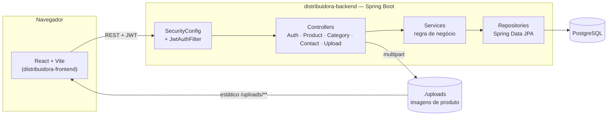

# Backend — Distribuidora (Java / Spring Boot)


API REST em **Java 17 + Spring Boot 3** com login (JWT), perfis e
permissões (RBAC) e auditoria. Atende dois front-ends:

- **Vitrine** (`distribuidora-vitrine`) — catálogo público, login e gestão
  de produtos.
- **ERP** (`distribuidora-erp`) — sistema interno de gestão, em construção
  por fases. Arquitetura e roadmap em
  [`docs/erp/ARQUITETURA-ERP.md`](docs/erp/ARQUITETURA-ERP.md).

Acesso por **perfil** (Administrador, Diretor/CEO, Gerente, Financeiro,
Compras, Vendedor, Estoquista, Expedição, Logística e Cliente do site),
cada um com um conjunto de **permissões** editável pelo ERP. O
Administrador tem todas. Clientes que se cadastram pela vitrine recebem o
perfil Cliente, sem acesso ao ERP.

## Arquitetura



Camadas clássicas do Spring Boot (`controller → service → repository`), com
DTOs isolando a API das entidades JPA — não é Clean Architecture formal, mas
uma arquitetura em camadas correta para o tamanho atual do projeto.

## Pré-requisitos

- **Docker** (recomendado — sobe backend + Postgres com um comando, sem
  precisar instalar Java nem Postgres na máquina), **ou**
- **JDK 17 ou superior** + **PostgreSQL** rodando localmente, se preferir
  rodar sem Docker.

## Como rodar

### Opção 1 — Docker (recomendado)

```bash
docker compose up --build
```

Sobe o backend **e** um Postgres já configurado, aplica as migrations do
Flyway automaticamente e popula os dados de exemplo. A API fica em
`http://localhost:8080`. Para parar e limpar os dados: `docker compose down -v`.

### Opção 2 — Java local

Não é necessário instalar o Maven: o projeto inclui o **Maven Wrapper**
(`mvnw` / `mvnw.cmd`), que baixa o Maven automaticamente na primeira
execução (precisa de internet nessa primeira vez).

```bash
mvnw.cmd spring-boot:run    # Windows
./mvnw spring-boot:run      # Linux/Mac/Git Bash
```

Ou abra a pasta no **IntelliJ IDEA** (detecta o `pom.xml` e importa como
projeto Maven automaticamente) e rode a classe `BackendApplication`.

Você precisa ter um PostgreSQL rodando e ajustar a conexão via variáveis de
ambiente (ou editando os valores padrão em `application.properties`):

```bash
DB_URL=jdbc:postgresql://localhost:5432/distribuidora
DB_USERNAME=postgres
DB_PASSWORD=postgres
```

Na primeira execução, o **Flyway** cria as tabelas e popula os dados
automaticamente (ver
[`src/main/resources/db/migration`](src/main/resources/db/migration)):

- `V1__init_schema.sql` cria o schema.
- `V2__seed_produtos_atacado.sql` cadastra os 86 produtos reais recebidos do
  fornecedor (carnes, hortifruti, frango, embutidos e peixes), com o código
  do fornecedor como SKU.
- O `DataSeeder` cria, além disso, as categorias e dois usuários padrão:

  | usuário   | senha      | papel |
  |-----------|------------|-------|
  | `admin`   | `admin123` | ADMIN |
  | `cliente` | `cliente123` | USER  |

  **Troque essas senhas** (variáveis `ADMIN_SEED_PASSWORD`/`DEMO_SEED_PASSWORD`,
  ou as chaves `app.seed.*` em `application.properties`) antes de usar isso
  fora da sua máquina.

## Documentação da API (Swagger)

Com o backend rodando: **http://localhost:8080/swagger-ui.html** — lista
todos os endpoints, com "Try it out" para testar direto do navegador
(cole o token JWT em Authorize).

## Testes

Testes unitários (JUnit 5 + Mockito) na camada de service, e testes de
integração da camada web com `MockMvc` — estes últimos sobem o contexto de
segurança de verdade (`SecurityConfig`), então provam que as regras de
acesso funcionam, não só o service isolado.

```bash
mvnw.cmd test    # Windows
./mvnw test      # Linux/Mac/Git Bash
```

| Classe | O que é coberto |
|---|---|
| `ProductServiceTest` | busca por slug; mudança de preço auditada com valor anterior e novo |
| `AuthServiceTest` | cadastro sempre como Cliente, login devolvendo perfis/permissões e o `role` legado, falha de login auditada (senha errada e usuário desativado) |
| `ContactServiceTest` | criar mensagem, usuário inexistente, listar só as próprias mensagens |
| `ProductControllerTest` | catálogo público, `401` sem login, `403` sem a permissão `produtos.editar`, `201` com ela, `400` em validação |
| `UserAdminControllerTest` | `/api/users` exige `usuarios.gerenciar`; hash da senha nunca sai na API |
| `UserAdminServiceTest` | ninguém se desativa nem tira o próprio perfil de administrador; sempre resta um administrador ativo |
| `RoleServiceTest` | Administrador não é editável; perfil do sistema ou com usuários não é excluído |
| `AccessResolverTest` | Administrador recebe toda permissão existente; perfis somam permissões; Cliente não recebe nenhuma |
| `AuditServiceTest` | grava só os campos alterados; ignora mudança só de escala decimal (79.9 × 79.90) |
| `LoginRateLimitFilterTest` | confirma que o rate limit do login conta certo (não em dobro) e bloqueia com `429` após o limite |

Além disso, o `docker-compose.yml` foi testado de ponta a ponta contra um
Postgres real (migration do Flyway, login, paginação, filtro por categoria
e por busca, Swagger) — não é um teste automatizado, mas foi validado
manualmente antes de cada entrega.

Ainda faltam: testes de integração com Testcontainers (Postgres real dentro
da suíte de testes) e cobertura dos demais controllers/services.

## Autenticação

1. **Login** — `POST /api/auth/login`
   ```json
   { "username": "admin", "password": "admin123" }
   ```
   Retorna o token, os perfis e as permissões:
   ```json
   { "token": "...", "username": "admin", "role": "ADMIN", "fullName": "Administrador",
     "roles": ["ADMINISTRADOR"], "permissions": ["auditoria.ver", "contatos.ver", "produtos.editar", "usuarios.gerenciar"] }
   ```
   `role` (`ADMIN`/`USER`) existe só para a vitrine: `ADMIN` = tem o perfil Administrador.

   Sem token (ou com token vencido) a API responde `401`; logado sem a
   permissão necessária, `403`.

2. Use o token nas próximas chamadas, no header:
   ```
   Authorization: Bearer <token>
   ```

3. **Cadastro** (sempre cria o perfil Cliente; usuários internos são criados
   pelo ERP, por quem tem `usuarios.gerenciar`) — `POST /api/auth/register`
   ```json
   { "username": "novo_cliente", "password": "senha123", "email": "opcional@exemplo.com" }
   ```

## Endpoints

| Método | Rota                       | Quem pode acessar        | Descrição |
|--------|----------------------------|---------------------------|-----------|
| POST   | `/api/auth/register`       | Público                   | Cria conta com perfil Cliente |
| POST   | `/api/auth/login`          | Público                   | Login, retorna JWT. Limitado a 5 tentativas/minuto por IP (`429` acima disso) |
| GET    | `/api/me`                  | Logado                    | Dados, perfis e permissões do usuário logado |
| GET    | `/api/categories`          | Público                   | Lista categorias |
| GET    | `/api/products`            | Público                   | Catálogo paginado — aceita `?page=`, `?size=` (padrão 100), `?category=` e `?search=` |
| GET    | `/api/products/{slug}`     | Público                   | Detalhe de um produto |
| POST   | `/api/products`            | `produtos.editar`         | Cria produto |
| PUT    | `/api/products/{slug}`     | `produtos.editar`         | Atualiza produto (todos os campos) |
| PATCH  | `/api/products/{slug}/price` | `produtos.editar`       | Atalho: só troca o preço |
| DELETE | `/api/products/{slug}`     | `produtos.editar`         | Remove produto |
| POST   | `/api/uploads`              | `produtos.editar`        | Envia uma imagem, retorna a URL para usar no campo `image` |
| GET    | `/uploads/{arquivo}`        | Público                   | Serve a imagem enviada |
| POST   | `/api/contacts`             | Logado                    | Envia mensagem para o vendedor |
| GET    | `/api/contacts/mine`        | Logado                    | Lista as próprias mensagens |
| GET    | `/api/contacts`             | `contatos.ver`            | Lista todas as mensagens recebidas |
| GET/POST/PUT | `/api/users`, `/api/users/{id}` | `usuarios.gerenciar` | Lista (busca, perfil, situação), cria e edita usuários |
| POST   | `/api/users/{id}/password`  | `usuarios.gerenciar`     | Define nova senha |
| GET/POST/PUT/DELETE | `/api/roles`, `/api/roles/{code}` | `usuarios.gerenciar` | Perfis e suas permissões |
| GET    | `/api/permissions`          | `usuarios.gerenciar`     | Permissões existentes |
| GET    | `/api/audit-logs`           | `auditoria.ver`          | Auditoria paginada — filtros `username`, `action`, `entityType`, `entityId`, `from`, `to` |

Toda alteração de produto, preço, usuário e perfil, e todo login (com
sucesso ou recusado), fica em `audit_logs`, que o próprio banco impede de
alterar ou apagar.

O catálogo (`GET /api/products` e `/api/categories`) é público de propósito,
para manter o mesmo espírito de vitrine aberta que o front-end já tem hoje.
Se preferir exigir login também para visualizar, basta remover essas duas
linhas de `.permitAll()` em
[`SecurityConfig.java`](src/main/java/com/distribuidora/backend/config/SecurityConfig.java).

### Exemplo: listar o catálogo (paginado, com filtro)

```
GET /api/products?category=carnes-aves&search=picanha&page=0&size=20
```

```json
{
  "content": [ { "id": "picanha-premium-98562", "name": "Picanha Premium", "...": "..." } ],
  "page": 0,
  "size": 20,
  "totalElements": 1,
  "totalPages": 1
}
```

Essa resposta é cacheada (Caffeine, 10 min) e invalidada automaticamente
sempre que um produto é criado/editado/removido — o cliente nunca vê dado
desatualizado, mas não bate no banco a cada visita ao catálogo.

### Exemplo: criar um produto (ADMIN)

```json
POST /api/products
Authorization: Bearer <token do admin>

{
  "slug": "azeitona-verde-99001",
  "sku": "99001",
  "name": "Azeitona Verde com Caroço",
  "category": "mercearia",
  "unit": "balde 2kg",
  "price": 32.5,
  "tags": ["Importado"],
  "description": "Azeitona verde em salmoura.",
  "origin": "Argentina",
  "available": true
}
```

### Exemplo: enviar a imagem de um produto (ADMIN)

```
POST /api/uploads
Authorization: Bearer <token do admin>
Content-Type: multipart/form-data

file: <arquivo da imagem>
```

Resposta: `{ "url": "http://localhost:8080/uploads/<nome-gerado>.jpg" }` — use essa
URL no campo `image` do produto (`POST`/`PUT /api/products`). Os arquivos ficam
salvos em `./uploads` (fora do controle de versão) e são servidos publicamente
em `/uploads/{arquivo}`.

### Exemplo: cliente entra em contato com o vendedor

```json
POST /api/contacts
Authorization: Bearer <token de qualquer usuario logado>

{
  "productSlug": "picanha-premium-98562",
  "message": "Qual o preço para 20kg?",
  "phone": "(85) 99999-9999"
}
```

## Estrutura do projeto

```
src/main/java/com/distribuidora/backend/
  config/       SecurityConfig, WebConfig, DataSeeder (dados iniciais)
  controller/   Endpoints REST (Auth, Product, Category, Contact, Upload)
  dto/          Objetos de entrada/saída da API (inclui PageResponse)
  exception/    Tratamento de erros (404, 409, validação)
  model/        Entidades JPA (User, Product, Category, ContactMessage)
  repository/   Acesso a dados (Spring Data JPA + Specifications)
  security/     JWT, LoginRateLimitFilter, integração com Spring Security
  service/      Regras de negócio (cache no catálogo)
src/main/resources/
  db/migration/       Migrations do Flyway (fonte de verdade do schema)
  application.properties       Config padrão (com fallback para dev local)
  application-prod.properties  Overrides sem fallback (exige env vars)
Dockerfile, docker-compose.yml, .github/workflows/ci.yml
```

## Configuração

A maior parte fica em `src/main/resources/application.properties`, com
segredos lidos de variáveis de ambiente (`${VAR:valor-padrao-para-dev}`):

| Variável | Para quê | Obrigatória em prod |
|---|---|---|
| `DB_URL` / `DB_USERNAME` / `DB_PASSWORD` | Conexão com o Postgres | Sim |
| `JWT_SECRET` | Assinatura do token JWT | Sim |
| `ADMIN_SEED_USERNAME` / `ADMIN_SEED_PASSWORD` | Credenciais do admin criado no primeiro start | Sim |
| `DEMO_SEED_USERNAME` / `DEMO_SEED_PASSWORD` | Credenciais do usuário de demonstração | Sim |

Ative o perfil de produção com `--spring.profiles.active=prod` (ou
`SPRING_PROFILES_ACTIVE=prod`): sem os valores padrão de desenvolvimento,
a aplicação falha ao subir se alguma dessas variáveis não for definida —
de propósito, para nunca ir ao ar com o segredo/senha de exemplo.

Outros pontos de configuração:
- `spring.cache.caffeine.spec` — tamanho/expiração do cache do catálogo.
- `app.rate-limit.login.*` — tentativas de login permitidas por minuto/IP.
- `CORS_ALLOWED_ORIGINS` — origens liberadas, separadas por vírgula. O
  padrão inclui a vitrine (`:5173`) e o ERP (`:5174`) locais e os
  domínios da Vercel.

## Próximos passos

Seguem o roadmap de
[`docs/erp/ARQUITETURA-ERP.md`](docs/erp/ARQUITETURA-ERP.md). Além dele:
testes de integração com Testcontainers (a migration V3 foi validada
manualmente contra um Postgres com os dados de produção simulados).
