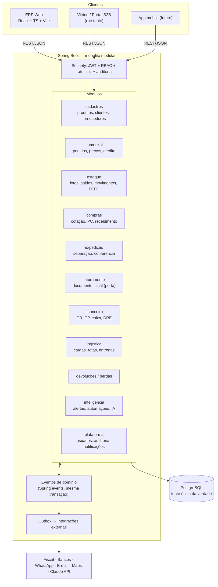
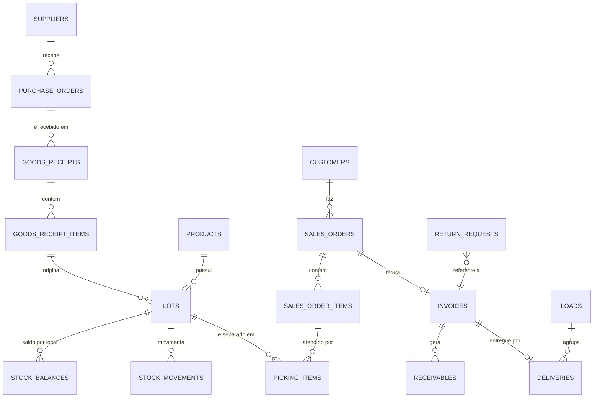
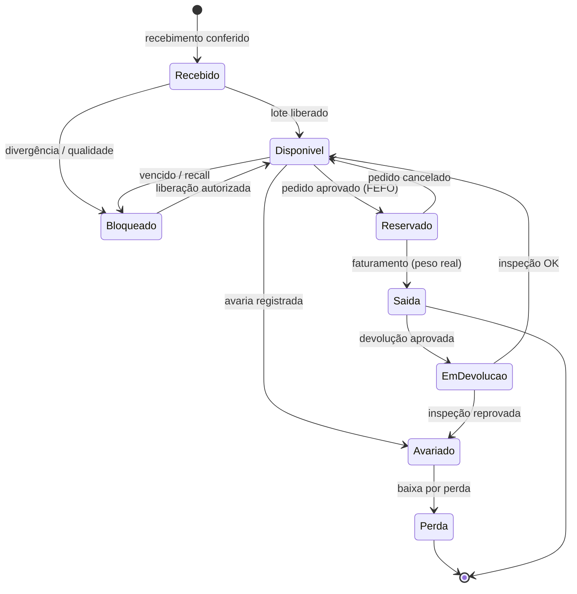
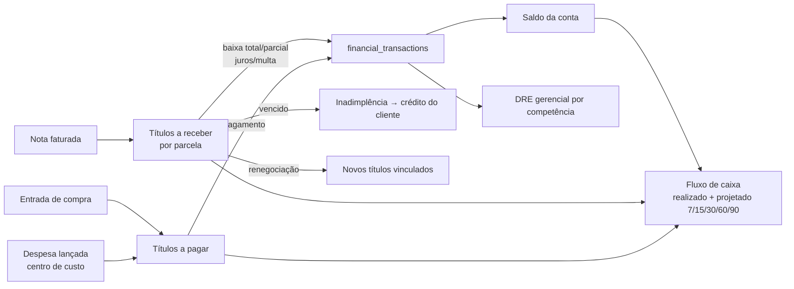
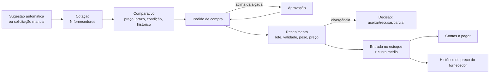
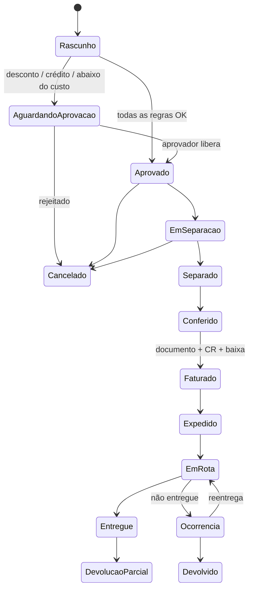
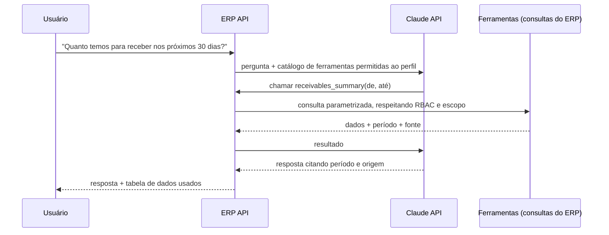

# ERP Real Frios — Análise e Arquitetura

> Documento-base do ERP. Toda implementação deve ser consistente com ele; quando
> uma decisão mudar, atualize este arquivo no mesmo commit.

**Pergunta-filtro de toda funcionalidade:** isso ajuda a vender, comprar,
controlar estoque, entregar, receber dinheiro, reduzir custo/perda ou decidir
melhor? Se não, não entra no roadmap.

---

## Status da implementação

| Fase | Situação | Onde |
|---|---|---|
| 0. Fundação | **Concluída** na branch `erp/fase-0` | Backend: migration V3, RBAC, auditoria. Front: repositório `distribuidora-erp` (login, usuários, perfis, auditoria) |
| 1. Cadastros | **Concluída** na branch `erp/fase-1` | V4: produtos (unidades e conversões, custo, estoque mín/máx, validade, fornecedores), clientes (carteira do vendedor, crédito), fornecedores, tabelas auxiliares. Front: telas de cadastro com consulta de CNPJ (BrasilAPI) e CEP (ViaCEP) |
| 2. Estoque | **Concluída** na branch `erp/fase-2` | V5: depósitos, lotes, saldos por situação (disponível, bloqueado, avariado), movimentos somente-inclusão, perdas com motivo e valor, transferências, FEFO, inventário com depósito congelado e contagem cega. Front: posição com indicadores, validade, movimentações, inventários |
| 3. Comercial | Próxima | — |

Decisões tomadas na fase 0 que ajustam o plano abaixo:

- **Auditoria explícita, não por anotação.** Os serviços chamam `AuditService.recordChange(...)` dentro da transação, passando o "antes" e o "depois"; o serviço grava só os campos que mudaram. É mais legível e testável que um aspecto `@Auditable`, e o diff sai correto mesmo com `BigDecimal` de escalas diferentes.
- **Identificador de usuário na auditoria é o login** (imutável), não o id numérico — quem audita lê "maria.vendas", não "Usuário 5".
- **Filiais e depósitos entram na fase 2**, junto com o primeiro dado transacional (estoque), em vez de tabelas vazias na fase 0.
- **401 × 403:** requisição sem token ou com token vencido responde 401; logado sem permissão responde 403. O ERP usa isso para voltar ao login.
- **Pendente de segurança:** o token ainda fica em `localStorage` com validade de 2 h. Refresh token rotativo em cookie `httpOnly` (seção 19) fica para antes de o ERP ir para produção.
- **Conversões de caixa derivadas do nome** na V4 ("CX 12 KG", "CX +- 20 KG" = peso variável): 63 dos 86 produtos saíram com conversão e 29 com peso variável, sem digitação.
- **Excluir produto pela vitrine agora desativa** (some do catálogo, mantém histórico). Nenhum cadastro é apagado.
- **Custo visível só com `produtos.custo.ver`** e alterável só com `produtos.custo.alterar`; margem calculada sobre o preço de venda com o custo médio.
- **Carteira:** sem `clientes.ver_todos`, o vendedor vê e cadastra só os próprios clientes (cliente de outra carteira responde 404). Limite de crédito e bloqueio exigem `clientes.credito.alterar` e são auditados separadamente.
- **Estoque:** toda alteração de saldo passa por `StockService.apply` (saldo travado com `FOR UPDATE` + movimento na mesma transação). Vencido não conta como disponível, não é transferido nem liberado — só baixado como perda. Peso variável entra pelo peso real, nunca pela caixa aproximada. Custo informado na entrada recalcula o custo médio ponderado (exige `produtos.custo.alterar`).
- **"Hoje" no fuso da empresa** (`app.timezone`, padrão America/Fortaleza): o servidor roda em UTC.
- **Compatibilidade com a vitrine:** o login continua devolvendo `role: "ADMIN" | "USER"`; `ADMIN` = usuário com perfil Administrador. Clientes cadastrados pela vitrine recebem o perfil `CLIENTE`, que não entra no ERP.

---

## 0. Ponto de partida (o que já existe)

| Item | Estado atual | Consequência para o ERP |
|---|---|---|
| Backend | Spring Boot 3.3, Java 17, JPA, Flyway (V1, V2), JWT, Bucket4j, Caffeine, springdoc | Base reaproveitada. Vira um **monólito modular**. |
| Banco | PostgreSQL (Render) com `products`, `categories`, `users`, `product_tags`, `contact_messages` | Evolui via migrations V3+. Nada é recriado. |
| Produtos | 86 produtos reais, `price DOUBLE`, `unit` texto livre, sem custo/estoque | Migrar dinheiro para `NUMERIC`, unidade para tabela, adicionar custo/estoque. |
| Usuários | enum `ADMIN`/`USER` | Substituído por RBAC (roles + permissions). `ADMIN` vira perfil Administrador. |
| Front público | `distribuidora-vitrine` (React JS) na Vercel | Continua sendo a vitrine/portal B2B; lê o mesmo cadastro de produtos. |
| Hospedagem | Render **free tier** (dorme após inatividade, 512 MB) | **Incompatível com ERP**: jobs agendados (alertas, inadimplência, validade) não rodam com o serviço dormindo. Exige instância paga antes de ir para produção. |

---

## 1. Arquitetura geral

**Decisão: monólito modular** (um deploy, um banco, módulos com fronteiras
explícitas). Microserviços trariam transações distribuídas justamente no ponto
em que o ERP precisa de consistência forte (pedido ↔ estoque ↔ financeiro).



### Regras de fronteira entre módulos

1. Cada módulo é um pacote `com.distribuidora.erp.<modulo>` com `api` (controllers/DTOs), `domain` (entidades, regras), `app` (serviços/casos de uso), `infra` (repositórios, adaptadores).
2. Um módulo **não acessa o repositório de outro**. Chama o serviço público do outro módulo ou reage a um evento.
3. Efeitos colaterais **dentro do ERP** (reservar estoque, gerar título) acontecem **na mesma transação** via serviço síncrono — é o que garante Single Source of Truth sem inconsistência.
4. Efeitos **fora do ERP** (e-mail, WhatsApp, fiscal, IA) passam pela tabela `outbox_events`, processada após o commit. Falha externa nunca desfaz uma venda.
5. Regras de arquitetura verificadas por teste (ArchUnit).

### Convenções técnicas obrigatórias

| Tema | Regra |
|---|---|
| Dinheiro | `BigDecimal` / `NUMERIC(14,2)`. Nunca `double`. |
| Quantidade | `NUMERIC(14,3)` sempre na **unidade base** do produto (kg ou un). Conversão só na borda (UI/pedido). |
| Custo unitário | `NUMERIC(14,4)`. |
| Datas | `timestamptz` para eventos; `date` para vencimentos e validades. |
| Multi-filial | `branch_id` em toda tabela transacional desde a V3, mesmo com uma filial só. |
| Exclusão | Soft delete (`active=false`) em cadastros. Transações financeiras e movimentos de estoque **nunca** são excluídos — só estornados. |
| Concorrência | `@Version` (lock otimista) em pedidos/títulos; `SELECT … FOR UPDATE` nos saldos de estoque ao reservar/baixar. |
| Paginação | Todo endpoint de listagem é paginado e filtrável no servidor. |
| Snapshot | Pedido e nota gravam preço, custo e margem **do momento**. Mudar o cadastro depois não altera o histórico. |

---

## 2. Módulos

| # | Módulo | Responsabilidade | Depende de |
|---|---|---|---|
| 1 | Plataforma | Usuários, perfis, permissões, filiais, auditoria, notificações, parâmetros | — |
| 2 | Cadastros | Produtos, unidades, categorias, marcas, clientes, fornecedores, condições de pagamento | Plataforma |
| 3 | Estoque | Depósitos, localizações, lotes, saldos por status, movimentos, reservas, inventário, FEFO | Cadastros |
| 4 | Comercial | Tabelas de preço, promoções, políticas de desconto, pedidos de venda, crédito, aprovações | Cadastros, Estoque, Financeiro (consulta) |
| 5 | Expedição | Listas de separação, conferência, divergências | Comercial, Estoque |
| 6 | Faturamento | Documento de saída, porta para emissor fiscal, geração de CR | Expedição, Financeiro, Estoque |
| 7 | Compras | Necessidade, cotação, pedido de compra, recebimento, conferência, custo médio | Cadastros, Estoque, Financeiro |
| 8 | Financeiro | Contas a receber/pagar, baixas, contas bancárias, fluxo de caixa, centros de custo, plano de contas, DRE | Plataforma |
| 9 | Logística | Veículos, motoristas, rotas, cargas, entregas, ocorrências, comprovantes | Faturamento |
| 10 | Devoluções e perdas | Fluxo de devolução, inspeção, destino, perdas/avarias | Estoque, Financeiro |
| 11 | Inteligência | Central de alertas, motor de automações, sugestão de compra, assistente de IA | Leitura de todos |
| 12 | Relatórios/BI | Dashboards por perfil, relatórios, DRE gerencial | Leitura de todos |

**Prospecção de leads** (pedido anterior — mapa com raio + cadastro manual)
entra no Comercial como pré-cliente (`leads`), convertido em `customer` sem
redigitação. Está no roadmap, fase 3.

---

## 3. Fluxos de negócio (visão integrada)

O fluxo central, com o que cada etapa dispara automaticamente:

| Evento | Estoque | Financeiro | Logística | Indicadores |
|---|---|---|---|---|
| Pedido criado | valida disponibilidade (não reserva) | valida crédito | — | pipeline |
| Pedido aprovado | **reserva** lotes por FEFO | exposição de crédito aumenta | — | carteira |
| Separação confirmada | troca reserva sugerida pelo lote realmente separado; registra peso real | — | pedido disponível para carga | — |
| Conferido → Faturado | **baixa física** (reservado → saída) | **gera títulos a receber** pelo valor faturado (peso real) + CMV | entrega criada | faturamento, margem |
| Expedido / Em rota | — | — | saída registrada | pedidos em rota |
| Entregue | — | — | comprovante | OTIF |
| Devolução aprovada | entrada em "devolução" → inspeção → destino | crédito/estorno do título | coleta | taxa de devolução |
| Cancelado | libera reserva | cancela títulos não pagos | cancela entrega | cancelamentos |

**Por que a baixa é no faturamento e não na aprovação:** em distribuição de
carnes/frios o peso real só é conhecido na separação (pedido de 20 kg sai com
20,7 kg). A nota e o título precisam do peso real; a reserva protege o estoque
até lá.

---

## 4. Entidades do banco

Agrupadas por módulo. `(E)` = já existe e será evoluída.

**Plataforma:** `branches`, `users (E)`, `roles`, `permissions`, `role_permissions`, `user_roles`, `user_branches`, `refresh_tokens`, `audit_logs`, `notifications`, `notification_preferences`, `system_parameters`, `outbox_events`, `attachments`.

**Cadastros:** `products (E)`, `categories (E)` (+ `parent_id` para subcategoria), `brands`, `units`, `product_units` (conversões), `product_suppliers`, `customers`, `customer_addresses`, `customer_contacts`, `customer_segments`, `suppliers`, `supplier_contacts`, `payment_terms`, `payment_term_installments`, `leads`.

**Estoque:** `warehouses`, `locations`, `lots`, `stock_balances`, `stock_movements`, `stock_reservations`, `inventory_counts`, `inventory_count_items`.

**Comercial:** `price_tables`, `price_table_items`, `customer_prices`, `promotions`, `discount_policies`, `volume_discount_tiers`, `sales_orders`, `sales_order_items`, `approval_requests`.

**Expedição / Faturamento:** `picking_lists`, `picking_items`, `picking_divergences`, `invoices`, `invoice_items`, `fiscal_documents`.

**Compras:** `purchase_requests`, `quotations`, `quotation_items`, `purchase_orders`, `purchase_order_items`, `goods_receipts`, `goods_receipt_items`, `supplier_price_history`.

**Financeiro:** `bank_accounts`, `financial_categories` (plano de contas), `cost_centers`, `receivables`, `payables`, `financial_transactions` (baixas/estornos), `renegotiations`, `customer_credits`.

**Logística:** `vehicles`, `drivers`, `routes`, `route_regions`, `loads` (cargas), `deliveries`, `delivery_occurrences`.

**Devoluções / perdas:** `return_requests`, `return_items`, `losses`.

**Inteligência:** `alerts`, `automation_rules`, `purchase_suggestions`, `ai_conversations`, `ai_messages`, `daily_sales_facts`, `daily_stock_snapshots`.

### Campos-chave das entidades centrais

```text
products          id, slug(E), sku, barcode, name, description, category_id, brand_id,
                  base_unit_id, sale_mode(UNIT|WEIGHT|BOX), variable_weight bool,
                  gross_weight, volume, storage(SECO|REFRIGERADO|CONGELADO),
                  lot_control bool, expiry_control bool, shelf_life_days, min_expiry_days_to_sell,
                  cost_price, average_cost, list_price, min_stock, max_stock, lead_time_days,
                  main_supplier_id, allow_backorder bool, published(vitrine) bool, active, version

product_units     product_id, unit_id, factor_to_base, nominal bool, default_for_sale, default_for_purchase
                  ex.: CX → 12.000 kg (nominal=true: peso real apurado na separação)

lots              id, product_id, supplier_id, code, manufactured_on, expires_on,
                  goods_receipt_item_id, received_at, status(LIBERADO|BLOQUEADO|VENCIDO)

stock_balances    branch_id, warehouse_id, location_id, product_id, lot_id,
                  qty_physical, qty_reserved, qty_blocked, qty_damaged, qty_returned, version
                  disponível = physical − reserved − blocked − damaged − returned (calculado)
                  UNIQUE(warehouse_id, location_id, product_id, lot_id)

stock_movements   id, type, product_id, lot_id, qty(base), unit_cost, from_location_id,
                  to_location_id, from_status, to_status, reason, source_type, source_id,
                  user_id, occurred_at, reversal_of_id
                  append-only; saldo = soma dos movimentos (reconciliável)

customers         id, legal_name, trade_name, document(CNPJ/CPF), state_registration, segment_id,
                  seller_id, price_table_id, payment_term_id, credit_limit, credit_status,
                  status, notes, lat/lng, branch_id, active

sales_orders      id, number, branch_id, customer_id, seller_id, status, price_table_id,
                  payment_term_id, delivery_address_id, expected_delivery_on, delivery_window,
                  subtotal, discount_total, freight, total, estimated_cost, estimated_margin,
                  blocked_reasons[], approved_by, approved_at, version

sales_order_items order_id, product_id, unit_id, qty_ordered, qty_base, qty_picked_base,
                  unit_price, list_price, discount_pct, unit_cost_snapshot, line_total, price_source

receivables       id, customer_id, invoice_id, installment_no, issue_date, due_date, amount,
                  paid_amount, interest, fine, status(ABERTO|PARCIAL|PAGO|VENCIDO|RENEGOCIADO|CANCELADO),
                  cost_center_id, financial_category_id, version

audit_logs        id, occurred_at, user_id, action, entity_type, entity_id,
                  old_value jsonb, new_value jsonb, reason, ip, user_agent, request_id
```

---

## 5. Relacionamentos (rastreabilidade)



- **Fornecedor → cliente:** `lots.supplier_id` → `picking_items.lot_id` → `sales_order_items` → `sales_orders.customer_id`.
- **Cliente → fornecedor:** caminho inverso. Uma única consulta de recolhimento (recall) responde "quais clientes receberam o lote X" em segundos.

---

## 6. Regras de negócio

### Estoque
- R-E1 Não existe saldo negativo. Exceção só com permissão `estoque.saldo.negativo` e fica auditado.
- R-E2 Lote vencido ou bloqueado **não** é reservável nem separável.
- R-E3 Lote com validade menor que `min_expiry_days_to_sell` do produto (ou do cliente) não é sugerido.
- R-E4 **FEFO**: reserva e sugestão de separação ordenam por `expires_on ASC, received_at ASC`. Produtos sem controle de validade usam FIFO por `received_at`.
- R-E5 Todo ajuste manual exige motivo e gera movimento + auditoria. Ajuste acima de X% ou R$ Y exige aprovação.
- R-E6 Inventário congela a localização, compara contagem × sistema e gera um único movimento de ajuste por diferença.

### Comercial
- R-C1 Preço resolvido nesta ordem: promoção vigente → preço específico do cliente → tabela do cliente → tabela do segmento → preço de lista. A origem fica em `price_source`.
- R-C2 Desconto acima do limite do **perfil** ou do **produto** → pedido vai para `AGUARDANDO_APROVACAO`, cria `approval_request`.
- R-C3 Venda abaixo do custo médio → sempre aprovação.
- R-C4 Produto inativo não pode ser vendido. Quantidade maior que o disponível é bloqueada, salvo `allow_backorder`.
- R-C5 Pedido mínimo por cliente/rota; abaixo disso, bloqueio ou frete.
- R-C6 Pedido é editável até a separação começar; depois, só cancelamento com motivo.

### Crédito
- R-CR1 Exposição = títulos em aberto + pedidos aprovados não faturados + pedido novo.
- R-CR2 Bloqueia se exposição > limite **ou** existe título vencido há mais de N dias (parâmetro). Mensagem: *"Pedido bloqueado — limite de crédito excedido (exposição R$ X / limite R$ Y)."*
- R-CR3 Liberação manual só com `credito.liberar`; registra justificativa em auditoria.

### Financeiro
- R-F1 Título nunca é excluído: cancelamento ou estorno geram lançamento reverso.
- R-F2 Juros e multa calculados na baixa conforme parâmetros; renegociação cancela títulos originais e cria novos vinculados.
- R-F3 Alteração de valor/vencimento de título auditada com valor anterior e novo.
- R-F4 Período fechado não aceita lançamento retroativo sem permissão `financeiro.periodo.reabrir`.

### Compras
- R-P1 Recebimento confere quantidade, lote, validade e preço contra o pedido de compra. Divergência acima da tolerância bloqueia a entrada até decisão.
- R-P2 Produto recebido com validade menor que X% do shelf life gera alerta (e pode ser recusado).
- R-P3 Entrada confirmada recalcula custo médio: `(saldo × custo_médio + qtd × custo_entrada) / (saldo + qtd)`.
- R-P4 Entrada gera contas a pagar conforme a condição do fornecedor.

---

## 7. Permissões (RBAC)

Permissões são strings `modulo.recurso.acao`, verificadas no backend com
`@PreAuthorize` — a UI só esconde botões, quem decide é a API. Além da
permissão há **escopo de dados**: vendedor vê só a própria carteira.

| Permissão (exemplos) | Admin | CEO | Gerente | Financ. | Compras | Vendedor | Estoq. | Expedição | Logíst. |
|---|---|---|---|---|---|---|---|---|---|
| `clientes.criar` | ✓ | | ✓ | | | ✓ | | | |
| `clientes.credito.alterar` | ✓ | ✓ | | ✓ | | | | | |
| `pedidos.criar` | ✓ | | ✓ | | | ✓ (carteira) | | | |
| `pedidos.aprovar_desconto` | ✓ | ✓ | ✓ | | | | | | |
| `pedidos.cancelar` | ✓ | | ✓ | | | | | | |
| `credito.liberar` | ✓ | ✓ | | ✓ | | | | | |
| `produtos.custo.ver` | ✓ | ✓ | ✓ | ✓ | ✓ | | | | |
| `produtos.preco.alterar` | ✓ | | ✓ | | | | | | |
| `estoque.consultar` | ✓ | ✓ | ✓ | | ✓ | ✓ | ✓ | ✓ | |
| `estoque.ajustar` | ✓ | | ✓ | | | | ✓ (com aprovação) | | |
| `expedicao.separar` / `conferir` | ✓ | | | | | | ✓ | ✓ | |
| `compras.pedido.aprovar` | ✓ | ✓ | ✓ | | | | | | |
| `financeiro.*` | ✓ | ✓ (leitura) | | ✓ | | | | | |
| `logistica.*` | ✓ | | ✓ | | | | | ✓ (leitura) | ✓ |
| `auditoria.ver` | ✓ | ✓ | | | | | | | |
| `ia.consultar` | ✓ | ✓ | ✓ | ✓ | ✓ | ✓ (escopo) | | | |

Perfis são dados (tabela), não enum: a empresa pode criar perfis novos sem deploy.

---

## 8. Automações

**Decisão:** motor de regras **parametrizável, não no-code**. Cada automação é
código testado (gatilho + condição + ação) com parâmetros editáveis na tela
(limiar, antecedência, destinatários, ativo/inativo). Um editor genérico de
regras gera regras frágeis que ninguém consegue testar.

| Gatilho | Condição | Ação | Destino |
|---|---|---|---|
| Movimento de estoque | disponível < mínimo | alerta + sugestão de compra | Compras |
| Job diário 06:00 | lote vence em ≤ N dias | alerta com qtd, valor e clientes que compram o produto | Estoque, Comercial |
| Job diário | lote vencido | bloqueia lote automaticamente + alerta | Estoque |
| Job diário | título vence amanhã | alerta | Financeiro |
| Job diário | título vencido | status `VENCIDO`, cliente em `credit_status=ATENCAO`, alerta ao vendedor | Financeiro, Vendedor |
| Job diário | cliente sem comprar há X dias (X relativo à frequência dele) | oportunidade de reativação | Vendedor |
| Job diário | cobertura projetada < prazo do fornecedor | sugestão de compra | Compras |
| Job horário | entrega fora da janela | alerta de atraso | Logística |
| Recebimento | custo > último custo + X% | alerta de aumento de preço | Compras, CEO |
| Job semanal | perdas do produto > média + 2σ | alerta de anomalia | Gerente |

Execução com `@Scheduled` + **ShedLock** (evita job duplicado com mais de uma
instância). Toda execução registra resultado para auditoria.

---

## 9. Integrações

Padrão **porta/adaptador**: o domínio define a interface; a implementação
concreta entra quando o fornecedor for contratado. **Não haverá implementação
fiscal fictícia** — sem provedor configurado, o documento fica em
`PENDENTE_EMISSAO` e isso aparece no painel.

| Porta | Uso | Candidatos (decisão futura) |
|---|---|---|
| `FiscalDocumentProvider` | NF-e/NFC-e, cancelamento, CC-e, XML/DANFE | Focus NFe, PlugNotas, NFE.io, eNotas |
| `BankStatementProvider` / `BoletoProvider` | boleto, PIX, conciliação | API do banco, Asaas, Inter |
| `NotificationChannel` | e-mail, WhatsApp, push | SMTP/SES, WhatsApp Cloud API |
| `GeocodingProvider` / `RoutingProvider` | coordenadas de cliente, roteirização | Google Maps, Mapbox, OSRM |
| `LlmProvider` | assistente e resumos | Claude API |
| API pública REST | portal B2B, e-commerce, app, CRM | `/api/v1`, OpenAPI, tokens de integração com escopo |

Saídas para fora passam pelo **outbox** (retentativa, idempotência, registro de falha).

---

## 10. Dashboards por perfil

| Perfil | Conteúdo principal |
|---|---|
| CEO | Faturamento dia/mês/ano × período anterior, margem bruta, lucro estimado, caixa atual e projetado, valor em estoque, CR × CP, perdas, "o que merece atenção hoje" (IA) |
| Comercial | Vendas por vendedor/cliente/categoria, ticket médio, margem, pedidos bloqueados, clientes inativos, metas |
| Financeiro | Saldo, CR/CP por vencimento, inadimplência (aging 0–30/31–60/61–90/90+), fluxo 7/15/30/60/90 dias |
| Compras | Estoque crítico, sugestões de compra com justificativa, compras em aberto, variação de custo por fornecedor |
| Estoque | Entradas/saídas do dia, vencendo, bloqueados, divergências, inventários abertos |
| Expedição | Kanban: aguardando separação → separando → separado → conferido → aguardando expedição → expedido |
| Logística | Cargas do dia, entregas por status, atrasos, ocorrências, OTIF |

Filtros globais: período, filial, vendedor, cliente, categoria, produto, fornecedor, status.

**Performance:** dashboards leem tabelas de fatos (`daily_sales_facts`,
`daily_stock_snapshots`) atualizadas por evento/job, não varrem pedidos a cada
acesso.

---

## 11. KPIs (definições únicas)

Cada KPI tem **uma** definição, usada no dashboard, no relatório e pela IA.

| KPI | Fórmula |
|---|---|
| Faturamento | Σ `invoice_items.line_total` de notas emitidas (não canceladas) no período |
| Ticket médio | faturamento ÷ nº de notas |
| CMV | Σ `qty × unit_cost_snapshot` dos itens faturados |
| Margem bruta | (receita líquida − CMV) ÷ receita líquida |
| Lucro estimado | margem bruta − despesas operacionais pagas/provisionadas |
| Valor em estoque | Σ `qty_physical × average_cost` |
| Giro | CMV do período ÷ estoque médio a custo |
| Cobertura (dias) | disponível ÷ venda média diária (90 dias, ponderada) |
| Inadimplência | Σ títulos vencidos ÷ Σ títulos com vencimento no período |
| OTIF | entregas no prazo e completas ÷ total de entregas |
| Taxa de perda | valor das perdas ÷ CMV |
| Taxa de devolução | valor devolvido ÷ faturamento |

---

## 12. Fluxo de estoque



Tipos de movimento: `ENTRADA_COMPRA`, `SAIDA_VENDA`, `TRANSFERENCIA`,
`AJUSTE_INVENTARIO`, `AJUSTE_MANUAL`, `PERDA`, `AVARIA`, `DEVOLUCAO_CLIENTE`,
`DEVOLUCAO_FORNECEDOR`, `BLOQUEIO`, `DESBLOQUEIO`, `ESTORNO`. Cada um registra
usuário, data/hora, motivo, produto, lote, quantidade, origem, destino e
documento de origem.

---

## 13. Fluxo financeiro



DRE gerencial: Receita bruta → (−) descontos/devoluções → Receita líquida →
(−) CMV → Margem bruta → (−) despesas operacionais por centro de custo →
Resultado operacional. Receita e CMV vêm das notas; despesas vêm do plano de
contas dos títulos a pagar.

---

## 14. Fluxo de compras



### Sugestão de compra (com justificativa)

```text
demanda_diária  = média ponderada das vendas dos últimos 90 dias (peso maior nos últimos 30)
estoque_seg     = z(nível de serviço) × desvio_diário × √prazo_fornecedor
ponto_pedido    = demanda_diária × prazo_fornecedor + estoque_seg
alvo            = mín(estoque_máx, demanda_diária × (prazo + ciclo_compra) + estoque_seg)
teto_perecível  = demanda_diária × (shelf_life_dias × fator_aproveitamento)   ← não compra mais do que vende antes de vencer
sugestão        = arredonda_para_unidade_compra( mín(alvo, teto_perecível) − (disponível + em_trânsito) )
```

Exemplo de justificativa exibida: *"Comprar 50 cx (600 kg) de Coxão Mole
Valencio. Venda média 38 kg/dia (90 d), disponível 210 kg (5,5 dias),
prazo do fornecedor 7 dias, 120 kg em trânsito. Teto por validade: 900 kg.
Último custo R$ 39,90/kg, melhor preço histórico R$ 37,10 (fornecedor B)."*

---

## 15. Fluxo de vendas



Ao abrir um pedido o sistema já conhece, pelo cliente: vendedor, tabela de
preço, condição de pagamento, endereço padrão, limite e exposição de crédito,
pedido mínimo e rota. O vendedor digita só produto e quantidade.

---

## 16. Fluxo logístico

Faturados → montagem de **carga** (por rota/região e janela) → validação de
capacidade do veículo (peso/volume) → ordem de entrega → saída (horário) →
entrega com comprovante (foto/assinatura/nome do recebedor) ou ocorrência
(cliente fechado, recusa, avaria, endereço) → retorno da carga com conciliação
(entregue, devolvido, reentrega).

Clientes guardam latitude/longitude (geocodificação no cadastro) para permitir
roteirização futura sem retrabalho — a mesma base serve ao mapa de prospecção.

---

## 17. Estrutura de IA

**Princípio:** a IA nunca inventa números e nunca executa SQL escrito por ela.



- **Ferramentas** = consultas de leitura já existentes no ERP (as mesmas dos relatórios), com parâmetros tipados: `sales_summary`, `top_products_by_margin`, `expiring_lots`, `inactive_customers`, `receivables_summary`, `purchase_suggestions`, `supplier_price_changes`, `losses_summary`, `cashflow_projection`.
- Cada chamada roda **com as permissões do usuário** que perguntou: vendedor não obtém dados financeiros pela IA.
- Toda resposta mostra período analisado, dados usados e definição do KPI (seção 11).
- **Resumo diário** ("o que merece minha atenção hoje") = alertas abertos priorizados por impacto em R$, reescritos em linguagem natural, cada item com o dado que o justifica.
- **Detecção de anomalias** é estatística e determinística (média, desvio, sazonalidade semanal), roda no motor de automações. A IA explica e prioriza; ela não é a fonte do alerta.
- Perguntas e respostas ficam registradas (`ai_messages`) para auditoria e melhoria.

---

## 18. Estratégia de auditoria

- Tabela `audit_logs` **append-only** (sem UPDATE/DELETE, garantido por permissão do usuário do banco).
- Gravada **na mesma transação** da alteração: se a auditoria falhar, a operação falha.
- Capturada na camada de serviço por anotação `@Auditable(action = "PRODUTO_PRECO_ALTERADO")` com diff campo a campo em `jsonb` (antes/depois), usuário, IP, user-agent e `request_id`.
- Ações obrigatoriamente auditadas: preço, custo, limite de crédito, desconto excepcional, liberação de crédito, ajuste de estoque, bloqueio/desbloqueio de lote, cancelamento de pedido, alteração/estorno financeiro, alteração de permissão, login e falha de login.
- Tela de auditoria (admin/CEO) com filtros por usuário, entidade, ação, período, e linha do tempo por registro.

---

## 19. Estratégia de segurança

| Área | Medida |
|---|---|
| Autenticação | JWT de acesso curto (15 min) + refresh token rotativo em cookie `httpOnly`/`Secure`/`SameSite`. Hoje o token fica em `localStorage` — mudar no ERP. |
| Sessão | Revogação de refresh token (logout, troca de senha, desativação do usuário); lista de sessões ativas. |
| Autorização | RBAC no backend por permissão + escopo de dados (carteira do vendedor, filial). |
| Senhas | BCrypt, política mínima, bloqueio progressivo (rate limit já existe no login). |
| Entrada | Bean Validation em todos os DTOs; JPA parametrizado; nenhuma SQL concatenada. |
| Transporte | HTTPS obrigatório, HSTS, CORS restrito por env var (feito). |
| Segredos | Somente variáveis de ambiente (padrão já adotado). |
| Dados sensíveis | Documento e dados bancários criptografados em repouso quando armazenados. |
| Observabilidade | Logs estruturados com `request_id`, Actuator protegido, alertas de erro. |
| Dependências | Dependabot + análise no CI. |
| Backups | Backup diário do Postgres com teste de restauração — exigência antes de produção. |

---

## 20. Roadmap de implementação

Cada fase entrega algo **usável na operação**, não telas vazias.

| Fase | Entrega | Por que nessa ordem |
|---|---|---|
| **0. Fundação** | Estrutura modular, dinheiro em `NUMERIC`, filial/depósito, RBAC com perfis, auditoria, novo app **ERP Web (React + TS)** com login, sidebar e layout | Tudo depende disso; corrigir `double` depois custa caro |
| **1. Cadastros** | Produtos completos (unidades e conversões, custo, mínimo/máximo, validade), clientes (Customer 360 básico), fornecedores, condições de pagamento | Sem cadastro não há transação |
| **2. Estoque** | Lotes, saldos por status, movimentos, entrada manual inicial (implantação), ajuste, perdas/avarias, inventário, FEFO, consulta de validade | Controle de perda é o maior ganho imediato num distribuidor de perecíveis |
| **3. Comercial** | Tabelas de preço, políticas de desconto, pedido com reserva FEFO, crédito, aprovações, **leads/prospecção (mapa + raio + cadastro manual)** | Começa a registrar a receita no sistema |
| **4. Expedição + Faturamento + CR** | Separação com peso real, conferência, faturamento (porta fiscal), títulos a receber, baixas | Fecha o ciclo pedido → dinheiro |
| **5. Compras + CP** | Sugestão de compra, cotação, pedido de compra, recebimento com lote, custo médio, contas a pagar | Fecha o ciclo compra → estoque → pagamento |
| **6. Financeiro** | Contas bancárias, fluxo de caixa 7–90 dias, centros de custo, plano de contas, DRE gerencial, inadimplência | Depende de CR/CP existirem |
| **7. Logística + Devoluções** | Veículos, motoristas, rotas, cargas, entregas, ocorrências, devoluções com destino | Depende de faturamento |
| **8. Dashboards e relatórios** | Dashboards por perfil, central de relatórios, exportação | Depende de dados reais das fases anteriores |
| **9. Automações e alertas** | Central de alertas, motor de automações, notificações in-app e e-mail | Alertas de estoque entram já na fase 2; aqui vira central única |
| **10. IA** | Assistente com ferramentas, resumo diário, explicação de anomalias | Só faz sentido com dados reais acumulados |
| **Depois** | Portal B2B (evolução da vitrine), app de entregador, WhatsApp, emissão fiscal real, conciliação bancária, multi-filial ativa | Integrações externas sobre a base pronta |

### Critério de pronto de cada módulo

1. Migration Flyway + entidades + regras no serviço com testes unitários das regras.
2. Teste de integração do fluxo que atravessa módulos (ex.: aprovar pedido reserva o lote FEFO correto).
3. Endpoints paginados, validados, com permissão e auditoria.
4. Tela no ERP Web consumindo a API real — nenhum dado mockado na interface.
5. Documentação OpenAPI e atualização deste documento.
